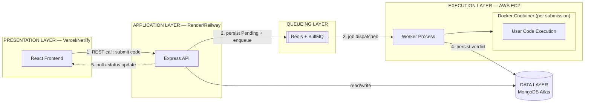

# Online Judge — High-Level Design (HLD) Document

| | |
|---|---|
| **Project** | Online Judge Platform (MERN Stack) |
| **Document Type** | High-Level Design (HLD) |
| **Scope Covered** | Version 1 (Core MVP) — Version 2 outlined as future scope |

## Table of Contents
1. Introduction & Scope
2. High-Level Architecture
3. Core System Components
4. Data Model
5. API Endpoints
6. Non-Functional Requirements & Roadmap
7. Scope for Version 2 (Enhancements)

---

## 1. Introduction & Scope

### 1.1 Purpose
This document presents the High-Level Design for the Online Judge platform, a full-stack web application built on the MERN stack (MongoDB, Express.js, React.js, Node.js) that allows users to solve programming problems and receive automated verdicts on submitted code.

To keep the build manageable, development is split into two versions:
- **Version 1 (Core MVP)** — the fully specified, production-ready core of the platform. The architecture, data model, APIs, and evaluation engine in this document describe Version 1 only.
- **Version 2 (Enhancements)** — planned future capabilities, outlined at a conceptual level in Section 7.

### 1.2 Version 1 Scope
Version 1 is limited to three user-facing screens and their supporting backend:

| Screen | Functionality |
|---|---|
| **Home Screen** | Problem list, user login/signup |
| **Problem Detail Screen** | Problem statement, language selector, embedded code editor (Monaco / CodeMirror), Submit button |
| **Profile Screen** | User's personal details and submission history |

Underpinning all three screens is the **Evaluation Engine** — a Docker-based sandboxed execution service, fronted by a message queue — which is the backbone of the system and is fully designed in this document regardless of version.

### 1.3 Out of Scope for Version 1
The following are explicitly deferred to Version 2 (Section 7) and are not part of this design:
- Admin dashboard / problem management UI
- Leaderboards and timed contests
- AI-assisted features (hints, error explanation, complexity analysis)
- Plagiarism detection, caching layer, and other production-polish items

---

## 2. High-Level Architecture

### 2.1 Architectural Style
The system follows a **modular, layered microservice-oriented architecture** with five independently deployable layers:

1. Presentation Layer (React)
2. Application Layer (Node.js + Express)
3. Queueing Layer (Redis + BullMQ)
4. Execution Layer (Dockerized Judge Engine, AWS EC2)
5. Data Layer (MongoDB)

This separation isolates untrusted code execution from the core application and allows each layer to scale independently.

### 2.2 Deployment Topology

| Layer | Hosting | Rationale |
|---|---|---|
| Presentation | Vercel / Netlify | CDN, free SSL, CI/CD from Git |
| Application | Render / Railway | Managed infra, Git-based deploys, env-var management |
| Queue | Redis (managed add-on, e.g. Upstash) | Lightweight, colocated with the Application Layer |
| Execution | AWS EC2 (Dockerized) | Full control of the container runtime and resource limits |
| Data | MongoDB Atlas | Managed, SSL-enabled, globally reachable |

### 2.3 Architecture Diagram



### 2.4 End-to-End Submission Flow

1. The user submits code via the Problem Detail screen; the client packages `{ code, language, problemId }`.
2. The frontend issues `POST /api/submissions` over HTTPS, with the user's JWT attached.
3. The Application Layer authenticates the request and validates the payload.
4. A `Solution` document is created in MongoDB with `verdict: "Pending"`.
5. The submission is enqueued on the Message Queue.
6. The Application Layer immediately returns `{ submissionId, status: "Pending" }`, decoupling acceptance from execution.
7. A Worker process dequeues the job once capacity is available.
8. The Worker provisions a fresh, resource-constrained Docker container.
9. Test cases for the problem are retrieved from the `TestCases` collection.
10. The submitted code is compiled/executed against each test case inside the sandbox.
11. Actual output is compared against expected output; a verdict is computed.
12. The Worker writes the verdict back to the `Solution` document.
13. The frontend retrieves the updated status via polling `GET /api/submissions/:id`.
14. The verdict is displayed to the user.

---

## 3. Core System Components

### 3.1 Presentation Layer (React.js)
Client-side single-page application responsible for rendering the three Version 1 screens and communicating with the Application Layer exclusively through REST APIs. Code editing is delegated to an embedded editor component (**Monaco** or **CodeMirror**) to provide syntax highlighting and a familiar IDE-like experience on the Problem Detail screen.

### 3.2 Application Layer (Node.js + Express.js)
Central orchestration layer responsible for:
- Authentication and authorization (JWT-based)
- Input validation
- CRUD operations against MongoDB
- Enqueuing submissions to the Queueing Layer

The Application Layer never executes user-submitted code directly.

### 3.3 Queueing Layer (Redis + BullMQ)
Buffers submissions between acceptance and execution. This exists specifically to address the **Thundering Herd problem**: without it, a burst of simultaneous submissions would attempt to spin up more containers than the Execution Layer can support, degrading or crashing the service. With a queue in place, submissions wait their turn and are processed at a sustainable rate, and additional Worker capacity can be added horizontally without touching the Application Layer.

### 3.4 Execution Layer / Evaluation Engine (Dockerized Judge Service)
The only component permitted to run user-submitted code.

- **Isolation** — every submission runs inside a newly created, disposable Docker container, built from a language-specific runner image (e.g. `oj-cpp-runner`, `oj-python-runner`).
- **Resource constraints**, applied per container:
  - `--memory` — hard memory ceiling (e.g. 256MB)
  - `--cpus` — limited CPU share (e.g. 0.5)
  - `--network none` — no network access, preventing outbound calls or data exfiltration
  - `--read-only` filesystem, except a scratch directory for code and I/O
  - A wall-clock timeout to terminate runaway processes
- **Disposability** — containers are destroyed (`--rm`) immediately after execution; no state persists between submissions.
- **Verdict computation** — actual output is diffed against expected output per test case, producing one of: `Accepted`, `Wrong Answer`, `Time Limit Exceeded`, `Memory Limit Exceeded`, `Runtime Error`, `Compilation Error`.
- **Write-path security** — the Execution Layer is not publicly addressable; it is reachable only over the Application Layer's private network, authenticated via an internal API key / short-lived JWT, and its database credentials are scoped to write only the `verdict` fields of the `Solutions` collection. This prevents unauthorized manipulation of verdicts, independent of code-level sandboxing.

### 3.5 Data Layer (MongoDB)
Persists all durable state: user accounts, the problem catalog, hidden/sample test cases, and submission history. Detailed in Section 4.

---

## 4. Data Model

Version 1 requires four collections.

### 4.1 `Users`
```javascript
const userSchema = new mongoose.Schema({
  fullName:  { type: String, required: true },
  email:     { type: String, required: true, unique: true },
  password:  { type: String, required: true }, // bcrypt hash
  dob:       { type: Date },
  createdAt: { type: Date, default: Date.now }
});
```

### 4.2 `Problems`
```javascript
const problemSchema = new mongoose.Schema({
  problemCode: { type: String, required: true, unique: true },
  name:        { type: String, required: true },
  statement:   { type: String, required: true },
  difficulty:  { type: String, enum: ["Easy", "Medium", "Hard"], default: "Easy" },
  tags:        [String],
  createdAt:   { type: Date, default: Date.now }
});
```

### 4.3 `TestCases`
```javascript
const testCaseSchema = new mongoose.Schema({
  problem:  { type: mongoose.Schema.Types.ObjectId, ref: "Problem", required: true },
  input:    { type: String, required: true },
  output:   { type: String, required: true },
  isSample: { type: Boolean, default: false }
});
```

### 4.4 `Solutions`
```javascript
const solutionSchema = new mongoose.Schema({
  user:          { type: mongoose.Schema.Types.ObjectId, ref: "User", required: true },
  problem:       { type: mongoose.Schema.Types.ObjectId, ref: "Problem", required: true },
  code:          { type: String, required: true },
  language:      { type: String, required: true },
  verdict: {
    type: String,
    enum: ["Pending", "Accepted", "Wrong Answer", "Time Limit Exceeded",
           "Memory Limit Exceeded", "Runtime Error", "Compilation Error"],
    default: "Pending"
  },
  executionTime: Number, // milliseconds
  memoryUsed:    Number, // KB
  submittedAt:   { type: Date, default: Date.now }
});
```

### 4.5 Entity Relationships
- `Problem` (1) → (*) `TestCase`
- `User` (1) → (*) `Solution`
- `Problem` (1) → (*) `Solution`

---

## 5. API Endpoints

| Method | Endpoint | Description | Auth |
|---|---|---|---|
| POST | `/api/auth/register` | Create a new user account | No |
| POST | `/api/auth/login` | Authenticate and issue a JWT | No |
| GET | `/api/auth/me` | Retrieve the logged-in user's profile | Yes |
| GET | `/api/problems` | List all problems (Home Screen) | No |
| GET | `/api/problems/:id` | Retrieve one problem's statement and sample test cases | No |
| POST | `/api/submissions` | Submit code for evaluation | Yes |
| GET | `/api/submissions/:id` | Retrieve verdict/status of a submission | Yes |
| GET | `/api/submissions/user/:userId` | Retrieve a user's submission history (Profile Screen) | Yes |

`POST /api/submissions` does not wait for execution to complete; it persists the submission, enqueues it, and returns immediately (Section 2.4). `GET /api/submissions/:id` is polled by the client until the verdict resolves.

---

## 6. Non-Functional Requirements

| Category | Requirement |
|---|---|
| **Scalability** | Application, Queue, and Execution layers scale independently; additional Worker instances can be added without redeploying the Application Layer. |
| **Security** | JWT-based authentication; password hashing (bcrypt); Execution Layer isolated on a private network; Docker containers run with no network access and strict resource limits. |
| **Availability** | Decoupling submission acceptance from execution keeps the API responsive even under Execution Layer load. |
| **Performance** | Submission acceptance responds in milliseconds; verdict turnaround depends on queue depth and container startup time. |
| **Maintainability** | Each layer is independently deployable with a single, well-defined responsibility. |
| **Data Integrity** | Verdict write access is scoped to the Execution Layer only, via internal authentication (Section 3.4). |


---

## 7. Scope for Version 2 (Enhancements)

The following capabilities are intentionally excluded from Version 1 and proposed as follow-on work.

### 7.1 Admin Dashboard
A restricted, role-gated interface (`role: "admin"` added to the `User` model) enabling:
- **Problem management** — create/edit problem statements, difficulty, and tags.
- **Hidden test case management** — upload/edit `TestCase` documents with `isSample: false`, kept invisible to end users.
- **System health monitoring** — queue depth, worker utilization, and error-rate dashboards, giving operators visibility into Execution Layer load in real time.

### 7.2 Leaderboards & Contests
Introduces a `Contest` collection (`name`, `startTime`, `endTime`, `problems: [ObjectId]`, `participants: [ObjectId]`). Scoring logic would extend the `Solution` model to associate a submission with a contest window and compute rank by problems solved and penalty time. A `GET /api/leaderboard/:contestId` endpoint would aggregate and rank participants — a feature referenced in the original problem statement but deferred here to keep Version 1 tightly scoped.

### 7.3 AI Integrations
Three proposed features, each additive to the Version 1 architecture without altering its core:
1. **AI Tutor / Hint Generator** — given a failing submission and the problem statement, an LLM call generates a graduated hint (e.g. "consider a two-pointer technique") without revealing a full solution.
2. **Compilation Error Explainer** — on `Compilation Error` verdicts, the raw compiler output is passed to an LLM to produce a plain-English explanation, reducing beginner friction with cryptic compiler messages.
3. **Automated Complexity Analysis** — static or LLM-assisted analysis of accepted submissions to estimate Big-O time/space complexity, surfaced as feedback beyond a binary pass/fail.

Each could run as a separate microservice invoked asynchronously from the Application Layer, keeping the Version 1 execution path unaffected.

### 7.4 Production Polish
- **Plagiarism Detection** — integrate a similarity-checking tool (e.g. MOSS) to flag near-duplicate submissions across users.
- **Redis Caching** — cache frequently read, rarely changed data (problem list, individual problem statements) to reduce MongoDB load.
- **WebSocket-Based Live Updates** — replace submission-status polling (Section 2.4, step 13) with a push-based update.
- **Horizontal Scaling of the Execution Layer** — orchestrate multiple Worker/EC2 instances (e.g. via Kubernetes) as submission volume grows.

---

*This document reflects the phased Version 1 / Version 2 approach agreed with the mentor. Version 1 is fully specified above; Version 2 is scoped conceptually and will be designed in detail once Version 1 is complete.*
