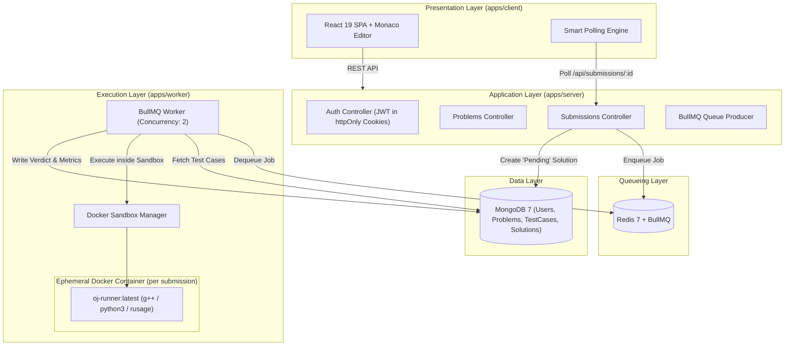

# Anti Online Judge — Sandboxed MERN Competitive Programming Platform

[](https://www.typescriptlang.org/)
[](https://nodejs.org/)
[](https://www.docker.com/)
[](https://react.dev/)
[](https://bullmq.io/)

A modern, production-grade, sandboxed Online Judge system built with the MERN stack (MongoDB, Express, React, Node.js), Redis + BullMQ asynchronous job queueing, and Dockerized ephemeral container sandboxing for C++17 and Python 3 code execution.

---

## 🏛️ System Architecture

The platform follows a decoupled, layered microservice architecture designed for isolation, security, and horizontal scalability:



---

## 🛡️ Sandboxed Execution & Security Controls

Untrusted user code is evaluated inside ephemeral, disposable Docker containers configured with strict defense-in-depth isolation:

- **Zero Inbound/Outbound Network:** `--network none` (prevents data exfiltration and external calls).
- **Resource Ceilings:** Hard memory limit `--memory 256m`, CPU throttle `--cpus 0.5`, process limit `--pids-limit 64` (prevents fork bombs).
- **Filesystem Hardening:** `--read-only` root filesystem with unprivileged user UID 1001 (`runner`).
- **CPU Time Driven:** Accurately measured user + system CPU time via GNU `time` / `rusage` metrics (Decision R3).
- **Fail-Fast Verdict Aggregation:** Evaluation halts immediately on the first non-`Accepted` test case (Decision R1).
- **Zero Hidden Test-Case Leakage:** Responses for hidden test cases return only the failing test case number and verdict, never hidden input or expected output (Decision R6).
- **IDOR Protection:** All user submission history endpoints derive the user identity directly from the signed JWT cookie (Decision R7).

---

## 📂 Monorepo Structure

```
anti-online-judge/
├── packages/
│   └── shared/                 # Shared TypeScript types, constants, schemas, diffOutput
├── apps/
│   ├── server/                 # Express REST API & Mongoose models
│   ├── worker/                 # Dockerized BullMQ execution worker
│   └── client/                 # React 19 + Vite + Monaco Code Editor SPA
├── docker-compose.yml          # Production container orchestration
└── DECISIONS.md                # Architectural decisions & risk register
```

---

## 🚀 Quick Start Guide

### Prerequisites
- **Node.js**: v20+ / v22+
- **Docker**: Docker Engine & Docker Compose
- **Redis & MongoDB**: Running locally on default ports or via Docker

### 1. Install Dependencies & Build Shared Library
```bash
npm install
npm run build:shared
```

### 2. Seed Database with DSA Problems
```bash
npm run seed:server
```
*Seeds 6 classic problems (Two Sum, Valid Parentheses, Reverse Array, Longest Unique Substring, Maximum Subarray, Trapping Rain Water) along with sample and hidden test cases.*

### 3. Build Runner Docker Image
```bash
npm --workspace=apps/worker run build:image
```

### 4. Start Development Services
Run the three layers concurrently in separate terminals:
```bash
# Terminal 1: REST API Server (Port 5000)
npm run dev:server

# Terminal 2: Execution Worker
npm run dev:worker

# Terminal 3: React SPA Frontend (Port 5173)
npm run dev:client
```

Open [http://localhost:5173](http://localhost:5173) to start solving problems!

---

## 🐳 Full Docker Compose Deployment

To orchestrate the complete stack (MongoDB, Redis, API Server, Worker, and Nginx Client) in one command:

```bash
docker compose up --build
```
Access the application at `http://localhost`.

---

## 🧪 Automated Test Suites

All packages include full automated test suites covering unit, sandbox, and integration layers:

```bash
# 1. Shared Utilities & Diff Normalization Tests
npm run test:shared

# 2. Docker Sandbox & Evaluator Engine Tests (C++, Python, TLE, RTE, CE)
npm run test:worker

# 3. REST API & Auth Integration Tests
npm run test:server
```

---

## 📑 API Endpoints Contract

| Method | Path | Auth | Description |
|---|---|---|---|
| `POST` | `/api/auth/register` | No | Creates user, sets JWT httpOnly cookie |
| `POST` | `/api/auth/login` | No | Authenticates user, sets JWT httpOnly cookie |
| `POST` | `/api/auth/logout` | No | Clears authentication cookie |
| `GET` | `/api/auth/me` | Yes | Retrieves user details & solve statistics |
| `GET` | `/api/problems` | No | Lists problems with difficulty, tags, acceptance |
| `GET` | `/api/problems/:identifier` | No | Retrieves problem statement and sample test cases only |
| `POST` | `/api/submissions` | Yes | Enqueues code submission for sandboxed judging |
| `GET` | `/api/submissions/:id` | Yes | Polls verdict, execution time, and memory metrics |
| `GET` | `/api/submissions/user/:userId` | Yes | Retrieves user's submission history (IDOR protected) |
| `GET` | `/api/submissions/problem/:id` | Yes | Retrieves user submissions for a specific problem |

---

## ⚖️ License
ISC License © 2026 Anti Online Judge
