# Entropy Online Judge — Sandboxed Competitive Programming & AI-Powered Evaluation Platform

[](https://www.typescriptlang.org/)
[](https://nodejs.org/)
[](https://www.docker.com/)
[](https://react.dev/)
[](https://bullmq.io/)
[](https://ai.google.dev/)
[](https://groq.com/)
[](https://openrouter.ai/)
[](LICENSE)

A modern, production-grade, sandboxed Online Judge and DSA learning platform. Built with the **MERN** stack (MongoDB, Express, React 19, Node.js), **Redis + BullMQ** asynchronous queues, **Docker** ephemeral container sandboxing for C++17 and Python 3.11, self-healing execution watchdogs, and a comprehensive **AI Intelligence Layer** (Socratic Debug Copilot, AI Problem QA Auditor, and Post-AC Complexity Classifier).

---

## 🏛️ System Architecture

The platform follows a decoupled, layered microservice architecture designed for isolation, defense-in-depth security, and horizontal scalability:

```mermaid
flowchart TB
    subgraph Client ["Presentation Layer (Vercel)"]
        UI["React 19 SPA + Monaco Code Editor"]
        MobileUI["Mobile Problem Workspace & Drawer"]
        KaTeX["KaTeX Math Engine + Markdown Renderer"]
        HintDrawer["Socratic AI Debug Copilot UI"]
        Timer["Practice Problem Timer & Stopwatch"]
        AdminStudio["Admin Problem Studio & Validator"]
        Poller["Smart Polling Engine"]
    end

    subgraph Server ["Application & AI Layer (Render)"]
        AuthAPI["Auth Controller (JWT in httpOnly Cookies / Bearer)"]
        ProbAPI["Problems Controller & RBAC Middleware"]
        SubAPI["Submissions & Live Sample Runner"]
        AdminAPI["Admin Problem Lifecycle & Sandbox Validator"]
        AIController["AI Controller (Hints, Review, Classify)"]
        AIEngine["AI Provider Resiliency & Token-Bucket Limiter"]
        Producer["BullMQ Queue Producer"]
    end

    subgraph ExternalAI ["External AI Provider Fallback Chain"]
        Gemini["Google Gemini Flash (~1M Context)"]
        Groq["Groq LLaMA 3.3 70B Versatile"]
        OpenRouter["OpenRouter DeepSeek / LLaMA Fallback"]
    end

    subgraph QueueLayer ["Queueing Layer"]
        SubQueue[("BullMQ: judge-submissions")]
        AIQueue[("BullMQ: ai-classify-jobs")]
    end

    subgraph ExecutionLayer ["Execution Layer (Azure VM)"]
        JudgeWorker["BullMQ Judge Worker (Concurrency: 2, Active Lock Renewal)"]
        Watchdog["Semaphore Heartbeat & Deadlock Auto-Recovery"]
        SandboxMgr["Docker Sandbox Manager"]
        subgraph Runner ["Ephemeral Docker Container (per test case)"]
            DK["entropy-runner:latest (g++-12 / python-3.11 / rusage)"]
        end
    end

    subgraph DataLayer ["Data Layer (MongoDB Atlas)"]
        MongoDB[("MongoDB Atlas M0 (Users, Problems, TestCases, Solutions)")]
        RedisCache[("Redis 7 (BullMQ State, Locks & Rate Limiting)")]
    end

    UI -->|"REST API (CORS & Edge Rewrites)"| Server
    MobileUI -->|"REST API (CORS & Edge Rewrites)"| Server
    Poller -->|"Poll /api/submissions/:id"| SubAPI
    SubAPI -->|"Enqueue Judge Job"| SubQueue
    SubAPI -->|"Create 'Pending' Solution"| MongoDB

    AIController --> AIEngine
    AIEngine --> Gemini
    AIEngine -.->|"Fallback"| Groq
    AIEngine -.->|"Fallback"| OpenRouter

    JudgeWorker -->|"Dequeue Job"| SubQueue
    JudgeWorker -->|"Fetch Test Cases"| MongoDB
    JudgeWorker -->|"Execute inside Sandbox"| SandboxMgr
    Watchdog -->|"Monitor / Reset Leaked Slots"| JudgeWorker
    SandboxMgr --> DK
    JudgeWorker -->|"Write Verdict & Metrics"| MongoDB

    AIQueue -->|"Async Post-AC Classification"| AIController
```



---

## ✨ Key Features & Capabilities

### 1. 🧑‍💻 Student & Competitor Experience
- **Adaptive Problem Workspace (Desktop & Mobile)**:
  - **Desktop Layout**: Fully resizable independent split panels via `react-resizable-panels` with Monaco Code Editor, KaTeX math typesetting, and scroll-locked statement description.
  - **Mobile Layout (`MobileProblemWorkspace.tsx`)**: Dedicated handheld workspace for $<768\text{px}$ viewports featuring bottom tabbed navigation (`Description`, `Code`, `Console`), touch-optimized action bar, and slide-up console drawer.
  - **Mobile Navigation Drawer (`Navbar.tsx`)**: Frosted glassmorphism slide-out navigation with responsive user account management.
- **Problem Practice Timer & Stopwatch (`ProblemTimer.tsx`)**: Built-in countdown timer and stopwatch with pause/resume and completion alerts, perfect for simulated technical interview practice.
- **Galaxy DSA Roadmap (`/galaxy`)**: Interactive star system roadmap visualizing problem dependencies, difficulty tiers, and NeetCode 150 category completion progress.
- **Docked Multi-Tab Console**:
  - **Test Cases Tab**: View public sample inputs and outputs with one-click copy.
  - **Results Tab**: Live testcase run diagnostics, memory usage (RSS KB), CPU execution time (ms), and failure indices.
  - **Diff Output Viewer**: Character-level comparison between expected vs. actual output with whitespace normalization.
  - **Compiler Output Tab**: Formatted syntax and compilation diagnostics.
- **Dual Language Support**: C++17 (GCC 12) with fast I/O optimizations and Python 3.11 with standard libraries.
- **Starter Code Draft Autosave**: Automatically preserves code drafts per language in `localStorage` across problem switches and browser refreshes.
- **Submissions History & Code Inspection**: Review all previous submissions with verdict badges, execution metrics, and full modal code viewer (BOLA/IDOR protected).
- **User Analytics & Profile Hub**: Solved vs. Attempted problem distribution, difficulty breakdowns (Easy, Medium, Hard), and personalized submission timeline.

---

### 2. 🧠 AI Intelligence Layer

#### 💡 Feature 1: Socratic Debug Copilot (Progressive 3-Tier Hints)
Guides students when they encounter `Wrong Answer`, `Time Limit Exceeded`, or `Runtime Error` without spoiling the solution:
- **Tier 1 (Algorithm & Direction)**: High-level conceptual guidance and algorithmic pattern nudges.
- **Tier 2 (Edge Case & Boundary)**: Boundary value hints (e.g., $N=0, 1$, negative numbers, overflow limits).
- **Tier 3 (Logic Bug & Optimization)**: Targeted logic diagnosis pointing to potential flaws in the approach.
- **Hard Security Guardrail**: Built-in **Code Block Stripper** (`stripCodeBlocks`) strictly removes any code fences, language syntax, or corrected snippets from model outputs before they reach the user.
- **Zero Hidden Test Case Leakage**: Only public sample test cases and student code are sent in AI prompts; hidden judge test cases are never exposed.

#### 🕵️ Feature 2: AI Problem-Setting QA Auditor (Gemini Flash ~1M Context)
A dedicated auditing tool for contest creators and problem setters:
- Comprehensive audit across statement, public samples, hidden judge cases, editorial, and reference model code.
- Detects **statement ambiguities**, **missing boundary/edge cases**, **adversarial inputs** (e.g. $O(N^2)$ TLE stress-tests), and **inconsistencies**.
- **Fault-Tolerant AI JSON Parser & Repair Engine** (`jsonRepair.ts`): Resilient multi-stage JSON extractor capable of repairing unescaped LaTeX backslashes (`\cdot`, `\le`), JavaScript expressions, trailing commas, and markdown wrappers.

#### 🏷️ Feature 3: Post-AC Approach & Complexity Classifier
- Automatically triggers upon `Accepted` verdict via an asynchronous background BullMQ job.
- Classifies algorithmic pattern (e.g., *Two Pointers*, *Monotonic Stack*, *Sliding Window*, *Dynamic Programming*), Big-O Time Complexity, Auxiliary Space Complexity, and suggests related harder problem codes.

---

### 3. 🛠️ Admin Problem Studio & Authoring Tool
- **Full Problem Authoring Lifecycle**: Interactive tabbed editor covering Metadata, Statement (Markdown + KaTeX split preview), Sample Cases, and Judge Test Cases.
- **Batch Test Case Importer**: JSON and raw delimiter bulk importer for large test suites.
- **Sandbox Model Solution Validator**: Run reference solutions in Python and C++ against all test cases inside the Docker sandbox with live diagnostic breakdowns before publishing (routed via BullMQ with a 45-second execution budget).
- **Centralized Model Solutions**: Reference model solutions in both Python 3.11 and C++17 pre-configured for standard DSA problems.
- **Role-Based Access Control (RBAC)**: Strict `admin` middleware verification and cascading deletion of problems, test cases, and solution records.

---

### 4. ⚡ Self-Healing Execution & Concurrency Watchdogs
- **Active Lock Renewal**: BullMQ worker is configured with a 300s lock duration and active lock renewals every 15 seconds (`lockRenewTime: 15000`), ensuring compute-heavy test suites never stall.
- **Pre-Flight Queue Draining (`drainStalledJobs`)**: Scans and clears leftover active jobs on worker reboot, preventing inherited deadlocks from previous process crashes.
- **Autonomous Semaphore Watchdog (`startSemaphoreHealthMonitor`)**: 30-second heartbeat monitor checks active semaphore slots against running Docker containers; automatically resets the semaphore if leaked slots are detected for $>60$ seconds.
- **Stale Submission Timeout**: 120-second timeout recovery marks abandoned pending evaluations as `Internal Error`, unblocking users from submitting new code.

---

## 🛡️ Sandboxed Execution & Security Architecture

Untrusted user code is executed in isolated, disposable Docker containers built on defense-in-depth principles:

| Security Dimension | Configuration | Purpose |
| :--- | :--- | :--- |
| **Network Isolation** | `--network none` | Completely prevents inbound/outbound calls, sockets, and data exfiltration. |
| **Memory Ceiling** | `--memory <limit>m` `--memory-swap <limit>m` | Clamps container memory (clamped to minimum 32MB); swap disabled to prevent host RAM thrashing. |
| **CPU Throttling** | `--cpus 0.5` (Run) / `--cpus 1.0` (Compile) | Prevents CPU starvation; precise CPU user+system time measured via `rusage`. |
| **Process Limit** | `--pids-limit 64` (Run) / `--pids-limit 128` (Compile) | Prevents fork bombs and background thread spawning. |
| **Filesystem Hardening**| `--read-only` root fs | User code cannot modify system binaries or system files. |
| **Temporary Storage** | `--tmpfs /tmp:rw,noexec,nosuid,size=32m` | Provides non-executable scratchpad memory. |
| **User Privileges** | Non-root UID 1001 (`runner`) | Container processes run with minimal Linux capabilities. |
| **Capability Dropping** | `--cap-drop=ALL` | Drops all kernel capabilities (e.g., `CAP_SYS_ADMIN`, `CAP_NET_RAW`). |
| **Privilege Escalation**| `--security-opt=no-new-privileges:true` | Blocks privilege escalation via setuid/setgid binaries. |
| **Disk Output Limit** | `ulimit -f 131072` in `runner.sh` | Hard 64MB file output ceiling prevents disk fill attacks. |
| **BOLA / IDOR Protection**| Signed JWT httpOnly Cookies / Bearer | Users can only inspect their own submission source code and history. |
| **Payload Protection** | Zod Schemas (Max 64 KB) | Prevents payload stuffing and database bloat. |

---

## 📂 Monorepo Structure

```
entropy-online-judge/
├── packages/
│   └── shared/                 # Shared TypeScript types, schemas, constants & model solutions
│       ├── src/constants/      # Supported languages, limits, verdicts & model solutions
│       ├── src/types/          # API contracts, AI schemas, judge payloads & DB interfaces
│       ├── src/utils/          # Diff output normalization & comparison utility
│       └── src/validation/     # Zod schemas for auth, submissions & problem authoring
├── apps/
│   ├── server/                 # Express REST API, Mongoose models, BullMQ queues & AI layer
│   │   ├── src/ai/             # AI Provider fallback chain, Socratic hints, QA review, JSON repair
│   │   ├── src/controllers/    # Auth, Problem, Submission, Admin & AI controllers
│   │   ├── src/models/         # User, Problem, TestCase & Solution Mongoose schemas
│   │   ├── src/queues/         # BullMQ queue producers (submission.queue.ts, ai.queue.ts)
│   │   ├── src/routes/         # Express API route declarations & rate limiters
│   │   ├── src/sandbox/        # Docker runner abstraction & compiler/execution wrappers
│   │   └── src/tests/          # Automated node:test integration & unit test suites
│   ├── worker/                 # BullMQ execution worker service
│   │   ├── src/evaluator/      # Sandboxed testcase evaluator & diff comparer
│   │   ├── src/queue/          # BullMQ submission worker with active lock renewal
│   │   ├── src/sandbox/        # Docker container manager, rusage metrics & semaphore watchdog
│   │   └── docker/             # Ephemeral execution container definitions
│   │       ├── Dockerfile.runner # Debian-based runner image (GCC 12, Python 3.11, GNU time)
│   │       └── runner.sh       # Execution script with rusage & output truncation
│   └── client/                 # React 19 + Vite + Monaco Editor SPA
│       ├── src/components/     # Monaco Editor, MobileProblemWorkspace, Navbar, ProblemTimer, Badges
│       ├── src/pages/          # HomePage, ProblemDetailPage, GalaxyPage, ProfilePage, Auth
│       └── src/pages/admin/    # AdminDashboardPage & AdminProblemEditorPage
├── docker-compose.yml          # Full stack local multi-container orchestration
├── docker-compose.prod.yml     # Production VM orchestration (Redis 7 + Worker)
├── render.yaml                 # Render Infrastructure-as-Code blueprint for API server
├── vercel.json                 # Vercel Edge CDN configuration & API reverse-proxy rewrites
└── README.md                   # System documentation
```

---

## 🚀 Quick Start Guide

### Prerequisites
- **Node.js**: `v20.x` or `v22.x`
- **Docker**: Docker Desktop / Docker Engine running
- **Redis & MongoDB**: Running locally (default ports `6379` and `27017`) or via Docker

---

### Step 1: Install Dependencies & Build Shared Library
```bash
# From workspace root
npm install
npm run build:shared
```

---

### Step 2: Configure Environment Variables
Create `.env` files in `apps/server`, `apps/worker`, and `apps/client` (or use `.env.example` templates):

**`apps/server/.env`**:
```env
PORT=5000
NODE_ENV=development
CLIENT_URL=http://localhost:5173
MONGO_URI=mongodb://localhost:27017/entropy_oj
REDIS_HOST=localhost
REDIS_PORT=6379
JWT_SECRET=super_secret_jwt_key_change_in_production
JWT_EXPIRES_DAYS=7
RUNNER_IMAGE=entropy-runner:latest

# AI Intelligence Layer Configuration
GEMINI_API_KEY=your_gemini_api_key_here
GROQ_API_KEY=your_groq_api_key_here
OPENROUTER_API_KEY=your_openrouter_api_key_here

FEATURE_AI_HINTS=true
FEATURE_AI_REVIEW=true
FEATURE_AI_CLASSIFY=true
```

---

### Step 3: Build Sandbox Runner Docker Image
```bash
npm run build:runner
```
*(Alias for `docker build -t entropy-runner:latest -f apps/worker/docker/Dockerfile.runner apps/worker/docker`)*

---

### Step 4: Seed Database with Problems
```bash
npm run seed:server
```
*Seeds standard DSA problems (**Two Sum**, **Valid Parentheses**, **Reverse Array**, **Longest Unique Substring**, **Maximum Subarray**, **Trapping Rain Water**, etc.) along with sample cases, hidden test cases, and a default admin account (`admin@entropy-oj.com` / `Admin123456!`).*

---

### Step 5: Start Development Services
Run the 3 applications concurrently:

```bash
# Terminal 1: REST API Server (Port 5000)
npm run dev:server

# Terminal 2: Execution Worker Service
npm run dev:worker

# Terminal 3: React SPA Client (Port 5173)
npm run dev:client
```

Open [http://localhost:5173](http://localhost:5173) in your browser.

---

## 🌐 Production Cloud Deployment

The live application is partitioned across dedicated cloud environments:

* **Presentation Layer (Frontend)**: Deployed on **Vercel**. `vercel.json` proxies `/api/:path*` requests directly to Render and serves the SPA with strict security headers (`X-Frame-Options: DENY`, `X-Content-Type-Options: nosniff`).
* **Application Layer (API Server)**: Deployed on **Render** using Docker runtime configured via `render.yaml`. Includes live `/api/health` probe reporting DB connection and Redis ping status.
* **Data Layer (Database)**: Cloud-hosted **MongoDB Atlas** M0 replica set cluster.
* **Execution Layer (Sandboxed Worker & Broker)**: Running on an **Azure Virtual Machine** orchestrated via `docker-compose.prod.yml`:
  * **Redis 7 (Alpine)**: Password-protected, AOF persistence, 512MB memory limit (`noeviction`).
  * **Worker Service (`apps/worker`)**: BullMQ consumer with Docker socket mount (`/var/run/docker.sock`) running unprivileged disposable containers (`entropy-runner:latest`).

---

## 🐳 Full Local Docker Compose

To build and run the entire multi-container stack in production mode locally:

```bash
docker compose up --build
```
Access the application at `http://localhost:8080`.

---

## 🧪 Automated Test Suites

The codebase includes thorough test coverage across shared types, sandboxed execution, REST APIs, and AI utilities:

```bash
# 1. Run Shared Package Tests (Diff Output & Normalization)
npm run test:shared

# 2. Run Execution Worker Tests (Docker Sandbox, TLE, RTE, CE, AC)
npm run test:worker

# 3. Run Server Integration Tests (REST APIs, Auth, Admin Lifecycle)
npm run test:server

# 4. Run Model Solutions Validation Tests (C++ and Python reference solutions)
npm --workspace=apps/server test dist/tests/modelSolutions.test.js

# 5. Run AI JSON Repair & Parser Tests
npm --workspace=apps/server test dist/tests/jsonRepair.test.js

# 6. Run Full Monorepo Test Suite
npm run test
```

---

## 📑 API Endpoints Reference

### 🩺 Health & Diagnostics
| Method | Endpoint | Auth | Description |
|---|---|---|---|
| `GET` | `/health` / `/api/health` | Public | Live system diagnostics, MongoDB state, and Redis ping |

### 🔐 Authentication
| Method | Endpoint | Auth | Description |
|---|---|---|---|
| `POST` | `/api/auth/register` | Public | Register new account & set JWT cookie |
| `POST` | `/api/auth/login` | Public | Authenticate user & set JWT cookie |
| `POST` | `/api/auth/logout` | Required | Revoke active session & blacklist JWT in Redis |
| `GET` | `/api/auth/me` | Required | Retrieve current user profile, role & solve stats |

### 📚 Problems & Galaxy Roadmap
| Method | Endpoint | Auth | Description |
|---|---|---|---|
| `GET` | `/api/problems` | Optional | List problems with search, difficulty & tag filters |
| `GET` | `/api/problems/galaxy/progress` | Optional | Retrieve user solve status for galaxy roadmap |
| `GET` | `/api/problems/:identifier` | Optional | Retrieve problem statement & sample test cases |

### ⚡ Submissions & Live Runner
| Method | Endpoint | Auth | Description |
|---|---|---|---|
| `POST` | `/api/submissions/run` | Required | Execute code against public sample cases (Live Runner) |
| `POST` | `/api/submissions` | Required | Enqueue submission for full sandboxed evaluation |
| `GET` | `/api/submissions/:id` | Required | Poll evaluation status, verdict, runtime & memory |
| `GET` | `/api/submissions/problem/:id` | Required | Retrieve current user's submissions for a problem |
| `GET` | `/api/submissions/user/:userId` | Required | Retrieve user's historical submissions (BOLA protected) |
| `GET` | `/api/submissions/user/:userId/solved` | Required | Retrieve distinct solved problems list |

### 🤖 AI Copilot & QA Auditor
| Method | Endpoint | Auth | Description |
|---|---|---|---|
| `POST` | `/api/ai/hints` | Required | Request 3-tier Socratic debug hint (code stripped) |
| `POST` | `/api/ai/classify` | Required | On-demand approach & Big-O complexity classification |
| `POST` | `/api/ai/review` | Admin | Run full package AI QA audit (Gemini Flash) |

### 🛠️ Admin Problem Management
| Method | Endpoint | Auth | Description |
|---|---|---|---|
| `GET` | `/api/admin/problems` | Admin | List all problems including hidden test case counts |
| `GET` | `/api/admin/problems/:id` | Admin | Get full problem package including hidden judge cases |
| `POST` | `/api/admin/problems` | Admin | Create new problem with sample & hidden test cases |
| `PUT` | `/api/admin/problems/:id` | Admin | Update problem details, constraints & test suites |
| `DELETE` | `/api/admin/problems/:id` | Admin | Permanently cascade delete problem and associated data |
| `POST` | `/api/admin/problems/:id/validate` | Admin | Execute model solution against all judge cases in Docker |

---

## ⚖️ License
Distributed under the **Apache License 2.0**. See [`LICENSE`](LICENSE) for more information.
