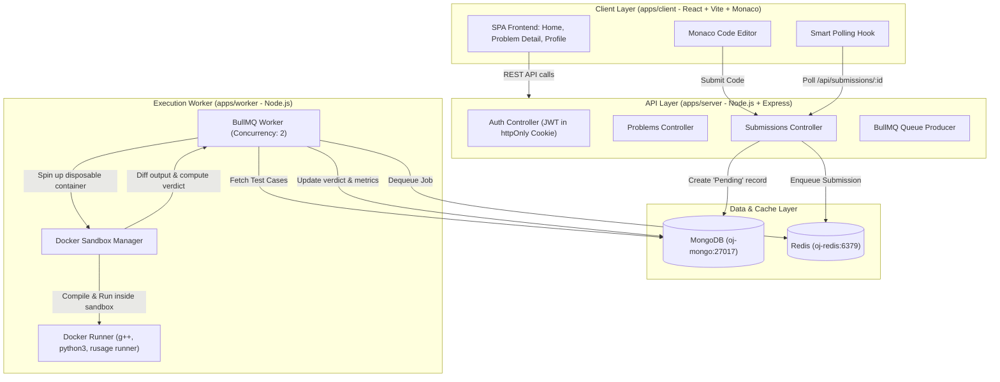

# Master Implementation Plan: Production-Grade MERN Online Judge Platform

An enterprise-grade, sandboxed Online Judge web application built on the MERN stack (MongoDB, Express, React, Node.js) with Redis + BullMQ asynchronous job scheduling and Dockerized isolated code execution for C++ and Python.

This plan details the full end-to-end architecture, phased execution roadmap, data contracts, sandboxing security mechanisms, and automated verification suites based on [Online_Judge_HLD_Doc.md](file:///c:/aamir_all_files/anti-online-judge/Online_Judge_HLD_Doc.md) and [DECISIONS.md](file:///c:/aamir_all_files/anti-online-judge/DECISIONS.md).

---

## User Review Required

> [!IMPORTANT]
> **Key Architecture & Security Commitments:**
> 1. **Monorepo Structure with npm Workspaces:** `packages/shared`, `apps/server`, `apps/worker`, and `apps/client`.
> 2. **Ephemeral Docker Sandboxing:** Docker containers per submission with `--network none`, `--memory 256m`, `--cpus 0.5`, `--pids-limit 64`, `--read-only`, and unprivileged runner user.
> 3. **CPU-Time Driven Limits & Fail-Fast Evaluation:** Evaluation stops at the first non-`Accepted` test case. CPU runtime is accurately metered.
> 4. **Zero Test-Case Data Leakage:** Responses for hidden test cases contain only the test case sequence number and verdict, never hidden input or expected output.
> 5. **Monaco Code Editor & Premium Dark UI:** Rich visual aesthetic with real-time submission tracking via smart polling, code history inspection, and comprehensive problem filtering.

---

## Architecture Overview



---

## Phase-by-Phase Implementation Roadmap

```mermaid
gantt
    title Online Judge Development Phases
    dateFormat  X
    axisFormat %s
    section Core Infrastructure
    Phase 0 - Monorepo & Shared Types/Utils :0, 1
    Phase 1 - Server API & MongoDB Layer    :1, 3
    section Execution Engine
    Phase 2 - Docker Sandbox & Language Runner :3, 5
    Phase 3 - BullMQ Worker & Verdict Engine  :5, 7
    section Frontend & Polish
    Phase 4 - React Client with Monaco Editor :7, 10
    Phase 5 - E2E Verification & Docker Compose:10, 12
```



---

## Proposed Project Structure

```
anti-online-judge/
├── package.json                   # Root monorepo configuration (workspaces)
├── docker-compose.yml             # Local orchestration (mongo, redis, server, worker, client)
├── .dockerignore
├── .gitignore
├── DECISIONS.md
├── Online_Judge_HLD_Doc.md
│
├── packages/
│   └── shared/                    # Shared types, constants, schemas, diff utility
│       ├── package.json
│       ├── tsconfig.json
│       └── src/
│           ├── constants/         # Verdicts, SupportedLanguages, Limits, Roles
│           ├── types/             # User, Problem, TestCase, Submission, Verdict
│           ├── validation/        # Zod schemas (auth, problem, submission)
│           ├── utils/             # diffOutput.ts (whitespace & line-ending normalization)
│           └── index.ts
│
├── apps/
│   ├── server/                    # Express REST API
│   │   ├── package.json
│   │   ├── tsconfig.json
│   │   ├── src/
│   │   │   ├── config/            # DB, Redis, Env validation
│   │   │   ├── models/            # User, Problem, TestCase, Solution
│   │   │   ├── middlewares/       # Auth (JWT cookie), ErrorHandler, RateLimiter
│   │   │   ├── controllers/       # Auth, Problems, Submissions
│   │   │   ├── routes/            # /api/auth, /api/problems, /api/submissions
│   │   │   ├── queues/            # submissionQueue producer
│   │   │   ├── seeds/             # Comprehensive DSA problems seeder
│   │   │   └── app.ts / server.ts
│   │   └── Dockerfile
│   │
│   ├── worker/                    # Execution Layer & Sandbox Engine
│   │   ├── package.json
│   │   ├── tsconfig.json
│   │   ├── docker/
│   │   │   ├── Dockerfile.runner  # Multi-language runner image (gcc, python3, runner script)
│   │   │   └── runner.sh          # Sandboxed execution script (metrics, timeout, limits)
│   │   ├── src/
│   │   │   ├── config/            # Worker & Redis config
│   │   │   ├── sandbox/           # DockerSpawner, ResourceLimits, Compiler, Evaluator
│   │   │   ├── queue/             # BullMQ SubmissionWorker
│   │   │   └── worker.ts
│   │   └── Dockerfile
│   │
│   └── client/                    # React 19 / Vite SPA
│       ├── package.json
│       ├── vite.config.ts
│       ├── index.html
│       ├── src/
│       │   ├── api/               # Axios client with interceptors
│       │   ├── context/           # AuthContext (login, register, logout, me)
│       │   ├── components/        # Navbar, MonacoEditor, VerdictBadge, Modal, Skeleton
│       │   ├── pages/             # HomePage, ProblemDetailPage, ProfilePage, NotFoundPage
│       │   ├── hooks/             # usePolling, useProblems, useSubmission
│       │   ├── styles/            # Vanilla CSS Design System (dark obsidian theme)
│       │   └── App.tsx / main.tsx
│       └── Dockerfile
```

---

## Detailed Component Specifications

### 1. Shared Package (`packages/shared`)
- **Verdicts Enumeration (`Verdicts`):**
  - `Pending`: In queue or running
  - `Accepted` (`AC`): All test cases passed within time & memory limits
  - `Wrong Answer` (`WA`): Output differed from expected output on a testcase
  - `Time Limit Exceeded` (`TLE`): CPU execution time exceeded limit
  - `Memory Limit Exceeded` (`MLE`): Peak memory exceeded limit
  - `Runtime Error` (`RTE`): Non-zero exit code (segfault, uncaught exception, zero division)
  - `Compilation Error` (`CE`): g++ compile failed with non-zero exit code
  - `Internal Error` (`IE`): Infrastructure failure / timeout in sandbox creation
- **Supported Languages (`SupportedLanguages`):**
  - `cpp`: C++17 (`g++ -O2 -std=c++17`)
  - `python`: Python 3.11+ (`python3`)
- **Diff Utility (`diffOutput`):**
  - Normalizes `\r\n` to `\n`
  - Trims trailing whitespace per line
  - Trims trailing empty lines at end of file
  - Compares line-by-line while strictly preserving internal space sequences

---

### 2. Application Layer (`apps/server`)
- **Security & Middleware:**
  - `cors`: Configured with credentials support for client origin.
  - `cookie-parser`: Reads `token` from `httpOnly` secure cookies.
  - `helmet`: Secure HTTP headers.
  - `rate-limiter`: Protects auth and submission endpoints from abuse.
- **Database Schema (Mongoose):**
  - `User`: `fullName`, `email` (lowercase, unique), `password` (bcrypt 12 rounds), `createdAt`.
  - `Problem`: `problemCode` (unique, e.g. `"two-sum"`), `name`, `statement` (Markdown), `difficulty` (`"Easy" | "Medium" | "Hard"`), `tags`, `timeLimitMs` (default 1000), `memoryLimitKb` (default 262144), `sampleCases` (array of sample test cases for public problem page), `createdAt`.
  - `TestCase`: `problem` (ref Problem), `input` (string), `output` (string), `isSample` (boolean), `order` (number).
  - `Solution`: `user` (ref User), `problem` (ref Problem), `code` (string), `language` (string), `verdict` (enum), `compileOutput` (string, for compilation errors), `executionTime` (number, ms), `memoryUsed` (number, KB), `failedTestCaseNumber` (number, optional), `totalTestCases` (number), `passedTestCases` (number), `submittedAt` (Date).
- **API Endpoints:**
  | Method | Path | Auth Required | Description |
  |---|---|---|---|
  | `POST` | `/api/auth/register` | No | Creates user, issues JWT in httpOnly cookie |
  | `POST` | `/api/auth/login` | No | Authenticates credentials, issues JWT |
  | `POST` | `/api/auth/logout` | No | Clears auth cookie |
  | `GET` | `/api/auth/me` | Yes | Retrieves authenticated user profile |
  | `GET` | `/api/problems` | No | Retrieves problem list with difficulty, tags, stats |
  | `GET` | `/api/problems/:id` | No | Retrieves problem statement and sample test cases only |
  | `POST` | `/api/submissions` | Yes | Validates payload, saves `Pending` solution, enqueues to BullMQ |
  | `GET` | `/api/submissions/:id` | Yes | Retrieves verdict & safe metrics for submission |
  | `GET` | `/api/submissions/user/:userId` | Yes | Retrieves user's submission history (verified against JWT user) |
  | `GET` | `/api/submissions/problem/:problemId` | Yes | Retrieves user's submissions for specific problem |
- **Database Seeder:**
  - Seeds 6+ classic DSA problems with markdown statements, sample cases, and multiple hidden edge test cases:
    1. *Two Sum* (Easy - Array / Hash Map)
    2. *Valid Parentheses* (Easy - Stack / Strings)
    3. *Reverse Linked List / Array Inversion* (Easy - Pointers)
    4. *Longest Substring Without Repeating Characters* (Medium - Sliding Window)
    5. *Maximum Subarray Sum (Kadane)* (Medium - Dynamic Programming)
    6. *Trapping Rain Water* (Hard - Two Pointers / Stack)

---

### 3. Execution Engine & Worker (`apps/worker`)
- **Multi-Language Runner Container (`Dockerfile.runner`):**
  - Base: Debian/Alpine minimal with `g++`, `python3`, `time`, `procps`.
  - Non-root user `runner` (UID 1001, GID 1001).
  - Wrapper runner script (`runner.sh`) that executes under `/usr/bin/time` with memory & CPU limits.
- **Sandboxing Constraints:**
  - Network: `--network none` (Prevents all network access / data exfiltration).
  - Memory: `--memory 256m` (Kernel OOM killer terminates over-allocations).
  - CPU limit: `--cpus 0.5`.
  - Process limit: `--pids-limit 64` (Prevents fork bombs).
  - Root filesystem: `--read-only` with only `/tmp/workspace` mounted with restricted permissions.
  - Security options: `--cap-drop ALL`, `--security-opt no-new-privileges:true`.
- **Compilation Phase (for C++):**
  - Dedicated compilation budget (e.g. 10s CPU time).
  - Compiles: `g++ -O2 -std=c++17 solution.cpp -o solution.out`.
  - If exit code != 0, captures `stderr` into `compileOutput` and marks verdict `Compilation Error`.
- **Test Case Execution & Verdict Evaluation:**
  - Evaluates test cases in sequence (`order: 1, 2, 3...`).
  - Measures user CPU time (in ms) and peak resident set memory (in KB).
  - If CPU time > problem `timeLimitMs` -> `Time Limit Exceeded`.
  - If exit code indicates non-zero / segfault / uncaught exception -> `Runtime Error`.
  - If output diff fails -> `Wrong Answer` (records `failedTestCaseNumber`).
  - Fail-Fast rule: Stops at first non-Accepted test case.
  - If all test cases pass -> `Accepted`.
  - Updates the `Solution` document directly in MongoDB.

---

### 4. Client Layer (`apps/client`)
- **Aesthetics & Design System:**
  - Sleek, modern dark-mode aesthetic (Deep Obsidian `#0d1117`, Slate Card `#161b22`, Border `#30363d`).
  - Accent colors: Emerald Green (`#238636` / `#3fb950` for Accepted), Crimson Rose (`#da3633` / `#f85149` for Failed), Amber Gold (`#d29922` for Medium/Pending), Electric Cyan (`#58a6ff` for Info/Links).
  - Font: Clean modern typography (Inter / JetBrains Mono).
- **Core Screens & Components:**
  1. **Navbar:** App branding, navigation links, theme indicators, authenticated user profile avatar & dropdown with logout.
  2. **Problem Catalog (Home Screen):**
     - Search bar, difficulty filter pills (All, Easy, Medium, Hard), tag filters.
     - Problem table with Problem Code, Title, Difficulty badge, Tags, and Acceptance rate.
     - User solve status icon (Solved / Attempted / Unattempted).
  3. **Problem Detail & Coding Workspace:**
     - Left Split Pane: Problem statement, examples, constraints, sample test cases, tab for user's past submissions for this problem.
     - Right Split Pane: Monaco Code Editor with language picker (C++ / Python), starter code templates, font-size adjustment, Reset Code, and Run/Submit buttons.
     - Bottom Console Drawer:
       - Custom input runner (runs against sample cases).
       - Live submission status tracker with animated pending state.
       - Detailed verdict card (Accepted, Wrong Answer on Test 3, Time Limit Exceeded, etc.).
       - Compiler Error drawer with formatted diagnostic output.
  4. **User Profile Screen:**
     - User bio, member since, stats summary cards (Total Solved, Easy/Medium/Hard breakdown, Total Submissions, Overall Acceptance Rate).
     - Full Submission History table with pagination/filtering, language badge, verdict chip, execution time, memory used, and a "View Code" modal to review submitted source.
  5. **Auth Modals / Pages:**
     - Sleek Sign-In and Register forms with validation and smooth state transitions.

---

## Verification & Testing Plan

### Automated Test Suites
1. **Unit Tests (`packages/shared`):**
   - Output diffing tests (exact match, whitespace differences, line ending differences, leading/trailing blanks, multiline matrices).
   - Validation schema tests (registration, login, submission payload).
2. **API Integration Tests (`apps/server`):**
   - Auth registration, duplicate email rejection, password hashing, JWT cookie issue.
   - Protected routes rejecting unauthenticated requests.
   - Problem retrieval (ensuring hidden test cases are never returned).
   - Submission creation and queue dispatch.
3. **Execution Sandbox Tests (`apps/worker`):**
   - C++ and Python correct submissions -> `Accepted` with valid time/memory.
   - C++ and Python wrong answers -> `Wrong Answer` (fail-fast at expected test index).
   - Infinite loop / slow computation -> `Time Limit Exceeded`.
   - Division by zero / Memory segfault / Exception -> `Runtime Error`.
   - C++ syntax error -> `Compilation Error` with populated `compileOutput`.
   - Security test: attempts to access network (`curl`, sockets), read `/etc/shadow`, or write outside scratch space -> Blocked by sandbox.

### Manual End-to-End Verification
- Complete user registration and login flow.
- Browse problems, filter by difficulty.
- Solve a problem in C++ and Python; observe live polling transition from `Pending` to `Accepted`.
- Submit buggy code (infinite loop, wrong calculation, syntax error) and verify accurate verdict feedback.
- Inspect submission history on Profile page and verify past code inspection modal.

---

## Next Steps Upon User Approval
Once approved, we will begin execution strictly phase-by-phase:
1. **Phase 0:** Initialize monorepo workspaces and implement `packages/shared`.
2. **Phase 1:** Build `apps/server` (Express API, Mongoose models, Auth, Seeds, Tests).
3. **Phase 2:** Build `apps/worker` Docker runner image and sandboxed execution manager.
4. **Phase 3:** Integrate BullMQ queue worker and run automated judge test matrix.
5. **Phase 4:** Build `apps/client` with Monaco Editor and dark-mode UI.
6. **Phase 5:** End-to-end integration and smoke verification.
